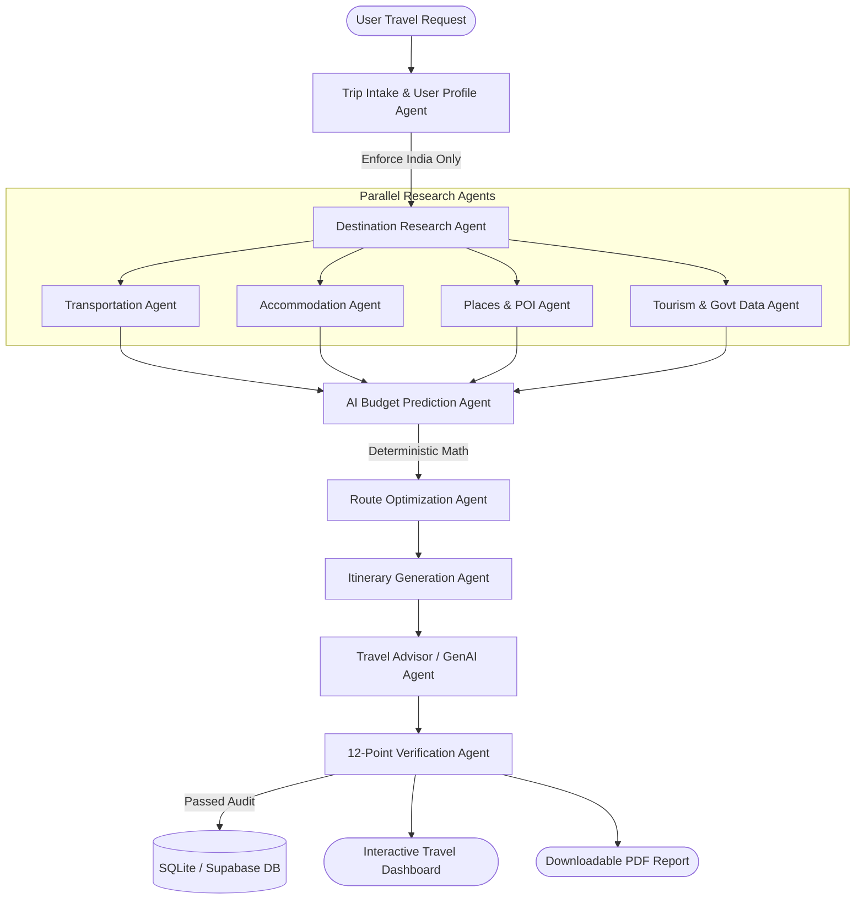

<<<<<<< HEAD
# 🇮🇳 Venky's AI Travel

> **"Your AI-Powered India Travel Planner"**  
> *An India-Only Generative AI Multi-Agent Travel Planning Platform.*

[](https://www.python.org/)
[](https://fastapi.tiangolo.com/)
[](https://react.dev/)
[](https://www.typescriptlang.org/)
[](https://tailwindcss.com/)
[]()
[](LICENSE)

---

## 🌟 Product Vision

**Venky's AI Travel** is a full-stack, production-grade Generative AI multi-agent web application dedicated **strictly to Incredible India**. Rather than acting as a simple superficial chatbot, it orchestrates a team of specialized autonomous AI agents that work together to create realistic, budget-friendly, geographically coherent, and personalized travel plans across all **28 Indian States and 8 Union Territories**.

Developed as a flagship **GenAI Internship Project**, it demonstrates:
1. **Generative AI & LLM Reasoning** (Google Gemini 2.0 / OpenAI / Fallback Engine)
2. **True Multi-Agent Architecture** with distinct agent responsibilities & Pydantic contracts
3. **Data Grounding** (Koson India Hotel API, Google Places, Indian Railways, Open Datasets)
4. **Deterministic Budget Engine** (Mathematical guarantee: Component Sum == Predicted Total)
5. **Dynamic Budget Optimization** ("Reduce My Budget" with granular savings deltas)
6. **12-Point Verification Agent** (Quality control gate for stay nights, route sanity, and prices)
7. **Professional PDF Reports** (Branded downloadable travel dossier via ReportLab)
8. **Cinematic UI/UX** (Tailwind v4, Leaflet interactive map, dark/light themes, donut charts)

---

## 🏗 Multi-Agent Workflow Architecture



---

## 🤖 Specialized AI Agents & Responsibilities

| Agent | Responsibility | Grounding / Tools |
| :--- | :--- | :--- |
| **1. Trip Intake Agent** | Validates Indian geography; gracefully rejects foreign destinations; normalizes dates, duration, travelers, and style. | Indian States & UTs catalog |
| **2. Destination Agent** | Researches regional climate, cultural highlights, authentic foods, and ideal durations. | Incredible India Directory |
| **3. Transportation Agent** | Evaluates multi-modal routes (Flight, Vande Bharat/Express Rail, AC Volvo Bus, Cab); calculates per-person fares and local transit. | Indian Railways / Bus Fare Matrix |
| **4. Accommodation Agent** | Searches stays matching user preferences (Hostel, 3-Star, Luxury); synchronizes stay nights (`duration - 1`). | Koson India Hotel API / Grounded Directory |
| **5. Places & POI Agent** | Finds attractions, landmarks, and viewpoints with verified coordinates and ASI entry ticket tariffs. | Google Maps & Places Grounding |
| **6. AI Budget Agent** | Synthesizes grounded costs into predicted components and enforces deterministic mathematical bounds. | Deterministic Calculation Engine |
| **7. Route Optimization Agent** | Clusters POIs geographically to minimize travel fatigue and prevent backtracking across cities. | Distance & Cluster Modeling |
| **8. Itinerary Agent** | Generates realistic Morning, Afternoon, and Evening schedules with commute buffers and dining suggestions. | Balanced Timeline Engine |
| **9. Tourism Data Agent** | Retrieves official government tourism board advisories, permit regulations, and 24x7 helpline numbers. | data.gov.in / API Setu / Ministry of Tourism |
| **10. Travel Advisor Agent** | Provides personalized tips, packing checklists, and regional greetings (Hindi, Telugu, Tamil, etc.). | Multilingual Generative Engine |
| **11. Verification Agent** | Mandates the 12-point quality gate; audits arithmetic sums, duplicate attractions, and pricing disclosures. | Quality & Consistency Gate |

---

## 💰 AI Budget Prediction & Transparency

A core technical principle of Venky's AI Travel is **zero financial hallucinations**:

$$\text{Total Budget} = \text{Transport} + \text{Accommodation} + \text{Food} + \text{Local Transit} + \text{Activities} + \text{Misc} + \text{Emergency Buffer}$$

- **Component Sum Strictness:** The AI Budget Prediction Agent predicts the cost components; backend arithmetic validation checks that the displayed components add up to the displayed total.
- **Prediction Interval Range:** Can display a lower and upper prediction range based on available data and uncertainty; it does not imply guaranteed pricing or rely on an unexplained fixed multiplier.
- **Source Badges:** Every item is explicitly marked as `[API GROUNDED]`, `[AI PREDICTED]`, or `[ESTIMATED]`.
- **"Reduce My Budget":** Re-evaluates accommodation and transit to find high-impact savings with a side-by-side comparison.
- **"Fit My Budget":** Evaluates target budgets (e.g., ₹20,000) and gives actionable suggestions.

---

## 🎨 UI/UX & Visual Design

The interface is built as a premium travel product rather than a generic admin dashboard or plain chatbot:

* **Graphical landing page:** Large destination imagery, clear hero copy, strong calls to action, and an India travel discovery section.
* **Destination explorer:** Image-led cards for popular Indian destinations, with state, highlights, recommended duration, and travel-style tags.
* **Interactive trip planner:** Guided multi-step form with visual selection cards for trip duration, travelers, interests, accommodation, and transport preferences.
* **AI planning screen:** Clear progress states for research, budget prediction, itinerary generation, and verification without exposing private chain-of-thought.
* **Trip result dashboard:** Destination hero, AI-predicted budget summary, graphical budget breakdown, day-by-day timeline, accommodation recommendations, food tips, and Leaflet interactive map.
* **Visual data transparency:** Distinct badges for API-grounded data, AI predictions, estimates, and user-provided values.
* **Responsive design:** Polished desktop, tablet, and mobile layouts with accessible contrast and readable typography.
* **Dark/light mode:** Seamless toggle with persistent theme preference.
* **Usability:** Every visible button and control performs its stated action.

---

## 🛠 Tech Stack

### Frontend
- **Framework:** React 19 + TypeScript
- **Tooling:** Vite 8
- **Styling:** Tailwind CSS v4 + Custom Glassmorphism & Animations
- **Icons:** Lucide React
- **Maps:** Leaflet OpenStreetMap with custom route polylines & marker pins
- **Data Visualization:** SVG animated budget donut chart

### Backend
- **Framework:** FastAPI (Python 3.12)
- **ASGI Server:** Uvicorn
- **ORM & DB:** SQLAlchemy 2.0 (SQLite local fallback, ready for PostgreSQL / Supabase)
- **Security:** Bcrypt (password salting & hashing) + Python-Jose (JWT authentication)
- **Document Generation:** ReportLab (PDF dossier generator)
- **Validation:** Pydantic V2 + Email-Validator

### External API Abstractions
- **Google Maps & Places API** (`GOOGLE_MAPS_API_KEY`)
- **Koson India Hotel API** (`KOSON_API_KEY`)
- **Data.gov.in & API Setu** (`DATA_GOV_API_KEY`, `API_SETU_API_KEY`)
- **Indian Data Project** (`INDIAN_DATA_PROJECT_API_KEY`)
- **LLM APIs** (`GEMINI_API_KEY` / `OPENAI_API_KEY`)

---

## 📁 Repository Structure

```
Pro_1/
├── backend/
│   ├── app/
│   │   ├── api/             # FastAPI Routers (auth, trips, destinations, search)
│   │   ├── agents/          # Autonomous Multi-Agent Implementations
│   │   ├── core/            # Config, security, JWT tokens
│   │   ├── data/            # Grounded Indian travel dataset (28 states + 8 UTs)
│   │   ├── database/        # SQLAlchemy session & relational models
│   │   ├── schemas/         # Pydantic V2 input/output schemas
│   │   ├── services/        # External API services, LLM, currency, PDF
│   │   └── main.py          # FastAPI application entry point
│   ├── tests/               # Pytest automated test suites
│   └── requirements.txt
├── frontend/
│   ├── src/
│   │   ├── components/      # UI components (Navbar, Planner, Map, Charts, Timeline)
│   │   ├── context/         # AuthContext & ThemeContext
│   │   ├── pages/           # Landing, Dashboard, PlanTrip, TripResult, Destinations
│   │   ├── services/        # API fetch client
│   │   ├── types/           # TypeScript data models
│   │   └── App.tsx
│   ├── index.html
│   └── package.json
├── .env.example             # Documented environment variables
└── README.md
```

---

## 🚀 Quickstart Guide

### 1. Prerequisites
- **Python 3.12+**
- **Node.js 18+** & **npm**

### 2. Backend Setup
```bash
cd backend

# Create virtual environment (optional)
python -m venv venv

# Activate (Windows):
venv\Scripts\activate

# Install dependencies
pip install -r requirements.txt

# Run the FastAPI server
python -m uvicorn app.main:app --host 127.0.0.1 --port 8000 --reload
```
API Documentation will be live at: **http://127.0.0.1:8000/docs**

### 3. Frontend Setup
```bash
cd frontend

# Install npm dependencies
npm install

# Start Vite dev server
npm run dev
```
Open **http://127.0.0.1:5173/** in your browser.

---

## 🛡 Demo Mode

The application includes an intelligent **`DEMO_MODE=true`** switch in `.env`. When external commercial API keys are not supplied, the platform automatically utilizes its rich curated Indian grounding directory (covering all 28 states, authentic POI coordinates, real stay rates, and transit connections), allowing judges, mentors, and evaluators to test every feature without any API paywalls.

---

## 🧪 Automated Testing

Run the automated test suite with pytest:

```powershell
# From repository root
$env:PYTHONPATH="backend"
python -m pytest backend/tests -v
```

### Test Coverage Highlights:
- ✅ `test_india_destination_validation`: Enforces India boundary validation; rejects Paris, Dubai, etc.
- ✅ `test_foreign_destination_pipeline_rejection`: End-to-end rejection of international queries.
- ✅ `test_full_multi_agent_pipeline_execution`: Validates 8-agent pipeline & 12-point audit.
- ✅ `test_budget_engine_deterministic_arithmetic`: Verifies mathematical component sums and bounds.
- ✅ `test_auth_flow`: Registration, login, and JWT token protection.
- ✅ `test_trip_plan_and_pdf_generation`: Verifies DB saving, streaming PDF generation, and budget optimization.

---

## 📄 Downloadable PDF Report

Every generated plan features a **"Download Trip Plan PDF"** button powered by ReportLab:
- High-resolution header with Venky's AI Travel branding
- Trip summary metadata (Destination, Duration, Travelers, Style)
- AI predicted budget breakdown table formatted in Indian Rupee notation (`₹XX,XXX`)
- Day-by-day Morning / Afternoon / Evening timeline with entry fees
- Recommended hotel cards with ratings and stay totals
- Regional food specialties & famous culinary spots
- Data sources disclosure and legal disclaimers

---

## ⚖️ Legal Disclaimer

*Travel prices, hotel availability, transportation fares, and attraction entry fees fluctuate dynamically based on season and market conditions. Venky's AI Travel provides predictive planning estimates and should not be treated as a guaranteed commercial booking quote. Verify real-time fares with official transport operators and hospitality providers prior to travel.*

---

## 👨‍💻 Author & Developer

**Paruchuri Venkatesh**  
B.Tech, Computer Science and Engineering (Artificial Intelligence & Machine Learning)  
Rajamahendri Institute of Engineering and Technology (RIET) | JNTUK  

* **GitHub:** [@paruchurivenkatesh](https://github.com/paruchurivenkatesh)  
* **LinkedIn:** [Paruchuri Venkatesh](https://www.linkedin.com/in/paruchuri-venkatesh-21a374345/)  

*Venky's AI Travel was developed as a GenAI-focused project exploring multi-agent architectures, India-focused travel planning, and AI-assisted budget prediction.*

---

**Developed with ❤️ for Incredible India.**
=======
# Venky-s_AI_Travel
>>>>>>> origin/main
